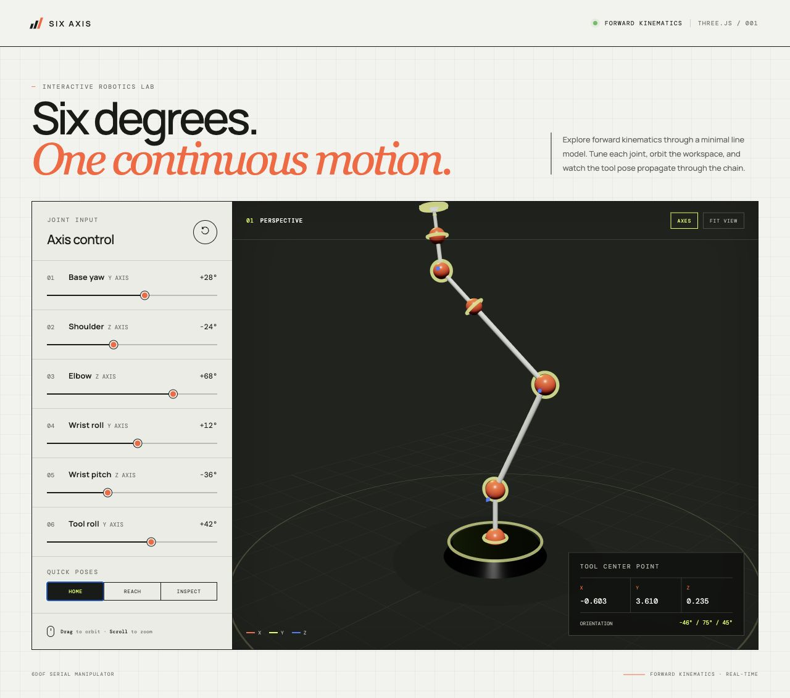
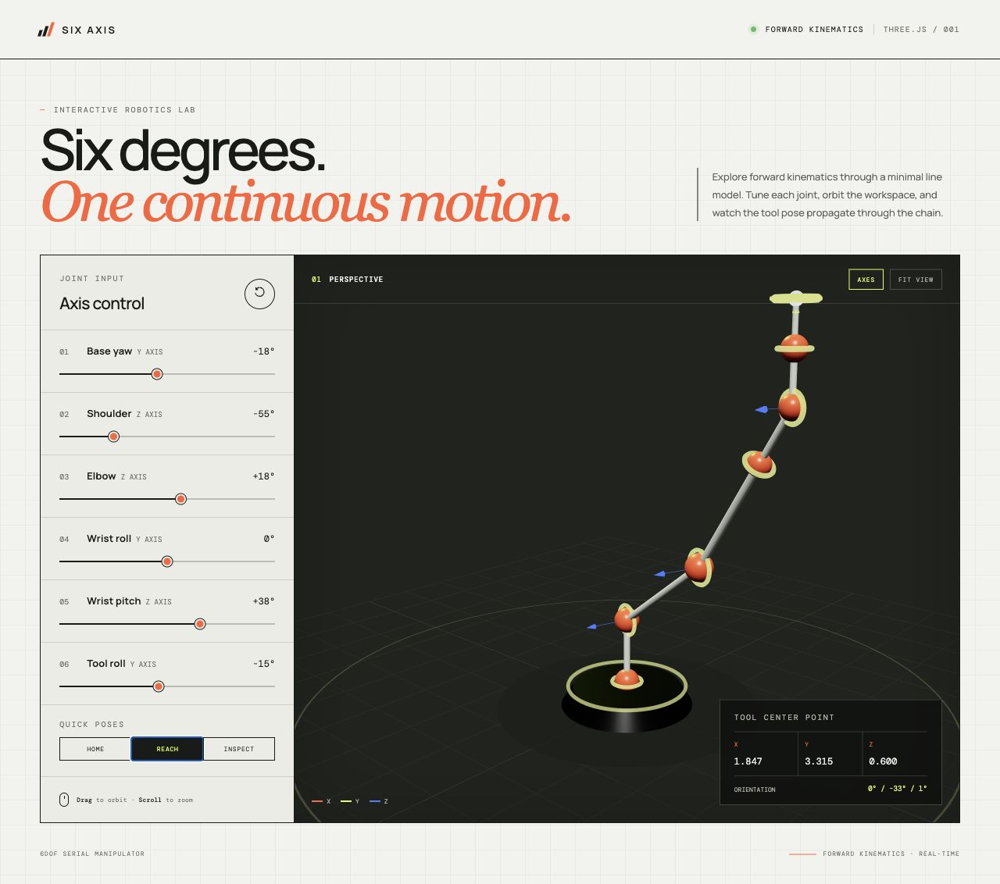
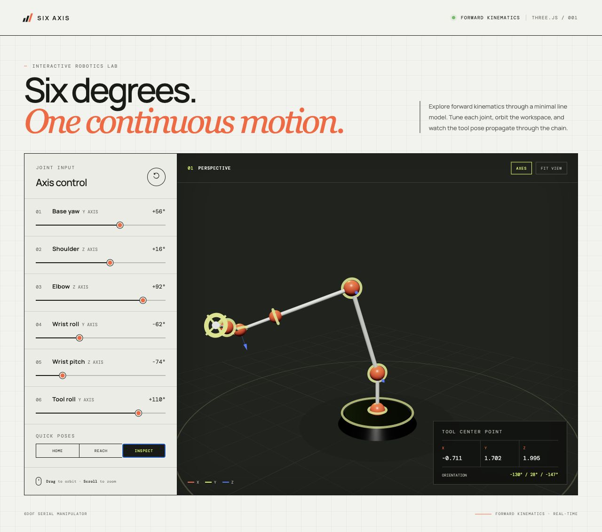

# Six Axis — 6DOF Arm Simulator

An interactive, line-based six degree-of-freedom robot arm simulator built with Three.js and Vite.

Created by [officer47p](https://github.com/officer47p).

## Preview



| Reach pose | Inspect pose |
| --- | --- |
|  |  |

## Run locally

```bash
npm install
npm run dev
```

Build the production bundle with:

```bash
npm run build
```

Each joint is represented as a nested Three.js transform, so rotations propagate down the full serial chain. The UI exposes all six joint angles, three preset poses, joint-axis helpers, a tool-path trace, and a live tool-center-point pose readout.
